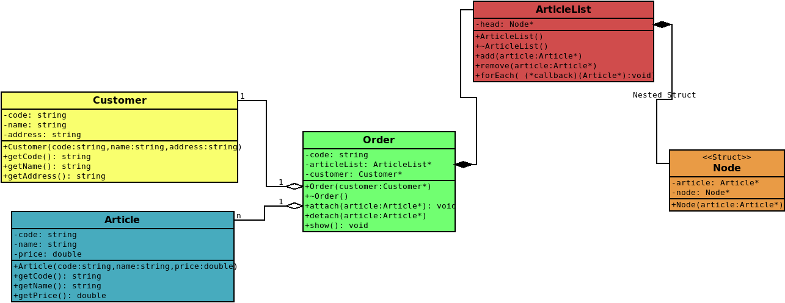

# CPP-Linked-List-Example
Customers, Orders and Article List Example

El fragmento relevante del ejemplo es este:

cpp:
void forEach(std::function<void(Article*)> callback) {
    Node* current = head;
    while (current != nullptr) {
        callback(current->article);  // Aquí se ejecuta la función lambda.
        current = current->next;
    }
}

Desglose detallado:
std::function<void(Article)> callback*:

std::function es una clase de plantilla que almacena un objeto invocable (como una función, un puntero a función, una lambda, etc.).
En este caso, acepta funciones que reciben un puntero a Article y no devuelven nada (void).
callback es el nombre del parámetro que representa la función que se ejecutará para cada artículo.
callback(current->article):

Este es el punto donde se llama a la función almacenada en callback, pasando el puntero al artículo actual (current->article).
Cuando invocamos este método forEach, pasamos una función lambda que define el comportamiento que queremos aplicar a cada artículo.
Uso de la lambda:

Una función lambda es una función anónima que puedes definir "en línea" y que puede capturar variables del contexto externo.
La sintaxis de una lambda es: [captura](parámetros) -> tipo_retornado { cuerpo }.
Por ejemplo, si quieres imprimir el nombre de cada artículo, puedes usar esta lambda cuando llames a forEachArticle:

cpp:
articleList.forEach( {
    std::cout << "Article: " << article->getName() << std::endl;
});

Explicación del forEach con la lambda:
[]: Significa que la lambda no captura ninguna variable externa.
(Article* article): Este es el parámetro de la lambda, que corresponde a un puntero a un objeto de tipo Article.
{}: Contiene el cuerpo de la lambda, donde defines la acción que debe realizar. En este caso, imprime el nombre del artículo.
